<a href="https://abdullah-waseem.vercel.app/">
  
</a>

<picture>
  <source media="(prefers-color-scheme: dark)" srcset="./assets/intro.svg" />
  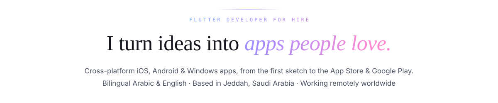
</picture>

<p align="center">
  <a href="mailto:muammad112266@gmail.com?subject=New%20app%20project">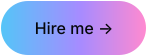</a>&nbsp;
  <a href="https://www.fiverr.com/users/abdullah3639"></a>&nbsp;
  <a href="https://www.linkedin.com/in/abdullahwaseem-dev/"></a>&nbsp;
  <a href="https://abdullah-waseem.vercel.app/"></a>
</p>

<br />


<br /><br />

<picture>
  <source media="(prefers-color-scheme: dark)" srcset="./assets/section-services.svg" />
  
</picture>

<p align="center">
  
  
  
  
  
  
</p>

<br />

<picture>
  <source media="(prefers-color-scheme: dark)" srcset="./assets/section-work.svg" />
  
</picture>

<p align="center">
  <a href="https://github.com/abdullahwaseem-dev/ALLAH_EVERYWHERE"></a>
  <a href="https://github.com/abdullahwaseem-dev/field-sales-management-system"></a>
  <a href="https://github.com/abdullahwaseem-dev/arrowtech-wristband-erp"></a>
  <a href="https://github.com/abdullahwaseem-dev/voltstore-redis-clone"></a>
  <a href="https://github.com/abdullahwaseem-dev/nexus-browser"></a>
  <a href="https://github.com/abdullahwaseem-dev/aura-match"></a>
</p>

<p align="center">
  <a href="https://apps.apple.com/app/id6811425021"></a>
  <a href="https://play.google.com/store/apps/details?id=com.allaheverywhere.app"></a>
</p>

<p align="center">
  <sub>
    Also live on the stores: <b>CheckIn</b> · <b>Virtual Try-On</b> · <b>HiTechie</b><br />
    More on GitHub:
    <a href="https://github.com/abdullahwaseem-dev/kidszone-kiosk">KidsZone Kiosk</a> ·
    <a href="https://github.com/abdullahwaseem-dev/gatepass">GatePass</a> ·
    <a href="https://github.com/abdullahwaseem-dev/atc-wristband-designer">ATC Wristband Designer</a> ·
    <a href="https://github.com/abdullahwaseem-dev/baobi-wristband-manager">Baobi Wristband Manager</a> ·
    <a href="https://github.com/abdullahwaseem-dev/claude-idea-validator">Claude Idea Validator</a>
  </sub>
</p>

<br />

<picture>
  <source media="(prefers-color-scheme: dark)" srcset="./assets/section-about.svg" />
  
</picture>

```dart
final abdullah = Developer(
  role:      'Flutter Developer · Software Department Head @ Arrow Technical, Jeddah',
  leads:     '17-engineer team',
  liveApps:  ['ALLAH Everywhere', 'CheckIn', 'Virtual Try-On', 'HiTechie'],
  ships:     ['iOS', 'Android', 'Web', 'Windows Desktop'],
  backend:   ['Firebase', 'Cloud Functions', 'NestJS', 'Node.js', 'PostGIS'],
  speaks:    ['English', 'العربية'],  // full RTL interfaces
  loves:     ['Offline-first', 'Clean architecture', 'Smooth 60fps UI'],
  available: 'Remote Flutter & Windows Desktop contract work',
);
```

<details>
<summary><b>How we'd work together</b></summary>
<br />

1. **Discovery call.** We talk through your idea, your users and your budget.
2. **Design & plan.** Screens, scope and a clear timeline before any code is written.
3. **Build in sprints.** You get a test build on your phone every week.
4. **Launch.** I publish to the App Store & Google Play and stay on for support.

</details>

<br />

<picture>
  <source media="(prefers-color-scheme: dark)" srcset="./assets/section-stack.svg" />
  
</picture>

<p align="center">
  <br />
  
</p>

<br />

<picture>
  <source media="(prefers-color-scheme: dark)" srcset="./assets/section-activity.svg" />
  
</picture>

<picture>
  <source media="(prefers-color-scheme: dark)" srcset="https://raw.githubusercontent.com/abdullahwaseem-dev/abdullahwaseem-dev/output/snake-dark.svg" />
  
</picture>

<br /><br />

<a href="mailto:muammad112266@gmail.com?subject=New%20app%20project">
  
</a>


<p align="center">
  <sub>Flutter developer · Mobile app developer · Freelance Flutter developer for hire · Dart · Firebase · iOS & Android · Windows desktop apps · Arabic RTL apps · ERP development · Jeddah, Saudi Arabia · Remote</sub>
</p>
